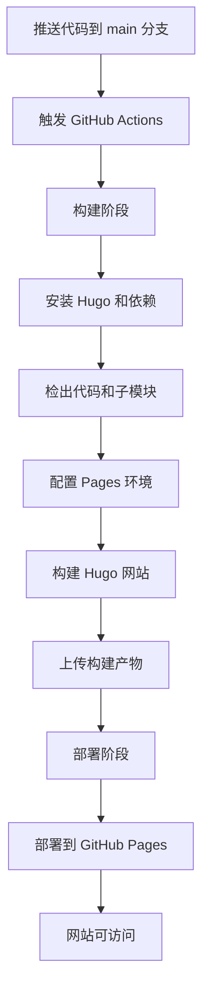

# 项目部署到 GitHub Pages 设计文档

## 概述

本设计旨在将当前 Hugo 静态网站项目配置为可以成功部署到 GitHub Pages（https://github.com/hlmu）。项目当前已具备基础的 GitHub Actions 工作流配置，但需要调整配置以确保正确部署到 GitHub Pages。

## 目标

- 确保项目可以自动部署到 GitHub Pages
- 配置正确的 baseURL 以适配 GitHub Pages 的 URL 结构
- 优化 GitHub Actions 工作流以支持 GitHub Pages 部署
- 确保网站在 GitHub Pages 上正常访问和运行

## 当前状态分析

### 现有配置

| 配置项 | 当前值 | 状态 |
|--------|--------|------|
| baseURL | https://resume.mhlwsk.com/ | 需要调整为 GitHub Pages URL |
| 主题 | hugo-resume | 已配置，使用子模块 |
| GitHub Actions | .github/workflows/hugo.yml | 已存在，需验证配置 |
| Hugo 版本 | 0.111.3 | 已在工作流中指定 |

### 关键问题识别

1. **baseURL 配置不匹配**：当前 baseURL 指向自定义域名，需要调整为 GitHub Pages 默认 URL 格式
2. **部署目标确认**：需要确认部署到用户级 GitHub Pages 还是仓库级 GitHub Pages
3. **仓库设置验证**：需要确保 GitHub 仓库已启用 Pages 功能

## GitHub Pages 部署类型选择

根据目标 URL（https://github.com/hlmu），存在两种可能的部署方式：

### 方案对比

| 特性 | 用户级 Pages | 仓库级 Pages |
|------|-------------|-------------|
| URL 格式 | https://hlmu.github.io/ | https://hlmu.github.io/resume-mhl/ |
| 仓库名称要求 | 必须为 hlmu.github.io | 任意名称 |
| baseURL 配置 | https://hlmu.github.io/ | https://hlmu.github.io/resume-mhl/ |
| 部署分支 | main 或 gh-pages | main 或 gh-pages |
| 适用场景 | 个人主页 | 项目展示页 |

### 推荐方案

基于当前项目为个人简历网站的性质，推荐采用**用户级 GitHub Pages**：

- **URL 更简洁**：直接使用 https://hlmu.github.io/
- **更符合个人品牌定位**：作为主要的个人展示页面
- **配置更简单**：无需处理子路径问题

**前置条件**：仓库名称需要为 `hlmu.github.io`

## 配置变更设计

### Hugo 配置调整（config.toml）

需要修改的配置项：

| 配置项 | 原值 | 新值 | 变更原因 |
|--------|------|------|---------|
| baseURL | https://resume.mhlwsk.com/ | https://hlmu.github.io/ | 适配 GitHub Pages URL |

**配置策略**：

直接在 config.toml 中设置 baseURL 为 GitHub Pages URL。虽然 GitHub Actions 工作流中使用了动态 baseURL（`steps.pages.outputs.base_url`），但在配置文件中设置正确的值可以确保本地预览和生产环境的一致性。

### GitHub Actions 工作流验证

当前工作流（.github/workflows/hugo.yml）已包含完整的 GitHub Pages 部署配置，关键要素：

**权限配置**：
- contents: read - 读取仓库内容
- pages: write - 写入 Pages 部署
- id-token: write - 用于 OIDC 认证

**构建流程**：
- 安装 Hugo CLI（Extended 版本 0.111.3）
- 检出代码（包括子模块）
- 配置 Pages 环境
- 使用动态 baseURL 构建站点
- 上传构建产物

**部署流程**：
- 使用 GitHub Pages 环境
- 部署构建产物到 Pages

**评估结果**：现有工作流配置符合 GitHub Pages 部署最佳实践，无需修改。

### GitHub 仓库设置要求

需要在 GitHub 仓库中进行的配置：

| 设置项 | 位置 | 配置值 | 说明 |
|--------|------|--------|------|
| Pages 功能启用 | Settings → Pages | 启用 | 激活 GitHub Pages |
| Source | Settings → Pages → Build and deployment | GitHub Actions | 使用 Actions 工作流部署 |
| 仓库名称 | Settings → General | hlmu.github.io | 用户级 Pages 必需 |

**操作流程**：
1. 进入仓库 Settings 页面
2. 导航到 Pages 设置
3. 在 "Build and deployment" 部分选择 Source 为 "GitHub Actions"
4. 确认仓库名称为 hlmu.github.io（如果当前不是，需要重命名仓库）

## 部署流程

### 自动部署触发条件

| 触发方式 | 条件 | 说明 |
|---------|------|------|
| 代码推送 | 推送到 main 分支 | 自动触发部署 |
| 手动触发 | workflow_dispatch | 从 Actions 页面手动运行 |

### 部署阶段划分

### 构建产物

| 产物 | 内容 | 用途 |
|------|------|------|
| public 目录 | 生成的静态 HTML/CSS/JS 文件 | GitHub Pages 服务的内容 |

## 验证策略

### 部署前验证

| 验证项 | 方法 | 预期结果 |
|--------|------|----------|
| 本地构建 | 运行 `hugo server` | 网站在本地正常运行 |
| 配置语法 | 检查 config.toml 语法 | 无语法错误 |
| 子模块状态 | 检查主题子模块 | 子模块正确初始化 |

### 部署后验证

| 验证项 | 方法 | 预期结果 |
|--------|------|----------|
| 网站可访问性 | 访问 https://hlmu.github.io/ | 返回 200 状态码 |
| 页面内容 | 检查首页内容 | 显示个人简历信息 |
| 资源加载 | 检查 CSS/JS 加载 | 所有资源正确加载 |
| 链接有效性 | 点击导航和内部链接 | 链接正常工作 |
| Actions 状态 | 查看 GitHub Actions 日志 | 构建和部署成功 |

### 故障排查

常见问题及检查点：

| 问题现象 | 可能原因 | 检查方法 |
|---------|---------|---------|
| 404 错误 | Pages 未启用或配置错误 | 检查仓库 Pages 设置 |
| 样式丢失 | baseURL 配置错误 | 检查页面源码中的资源路径 |
| 构建失败 | Hugo 版本不兼容或主题缺失 | 查看 Actions 构建日志 |
| 部署失败 | 权限不足 | 检查 Actions 权限配置 |
| 主题未加载 | 子模块未正确检出 | 检查子模块配置 |

## 变更影响分析

### 受影响的组件

| 组件 | 影响程度 | 影响描述 |
|------|---------|---------|
| config.toml | 低 | 仅修改 baseURL 一个配置项 |
| GitHub Actions | 无 | 无需修改 |
| 内容文件 | 无 | Markdown 文件无需修改 |
| 主题 | 无 | 主题文件无需修改 |

### 向后兼容性

- **自定义域名**：如果将来需要使用自定义域名（如当前的 resume.mhlwsk.com），可以在 GitHub Pages 设置中配置 Custom domain，无需修改 config.toml
- **URL 迁移**：从旧域名到新域名的迁移可能需要设置 301 重定向

## 实施步骤概要

实施本设计需要按照以下顺序进行：

1. **仓库准备**
   - 确认或重命名仓库为 hlmu.github.io

2. **配置文件修改**
   - 更新 config.toml 中的 baseURL

3. **GitHub 仓库设置**
   - 启用 GitHub Pages
   - 设置 Source 为 GitHub Actions

4. **代码提交和推送**
   - 提交配置变更
   - 推送到 main 分支

5. **验证部署**
   - 观察 GitHub Actions 执行
   - 访问部署的网站进行验证

## 安全性考虑

| 安全项 | 措施 | 说明 |
|--------|------|------|
| 敏感信息 | 避免在配置中暴露 | 不在代码中包含 API 密钥等敏感信息 |
| HTTPS | 使用 GitHub Pages 默认 HTTPS | GitHub Pages 自动提供 HTTPS |
| 权限最小化 | Actions 权限按需配置 | 工作流仅授予必要权限 |

## 维护性考虑

| 维护项 | 策略 | 频率 |
|--------|------|------|
| Hugo 版本更新 | 定期更新工作流中的 HUGO_VERSION | 季度检查 |
| 依赖更新 | 更新 Actions 使用的 action 版本 | 有新版本时 |
| 主题更新 | 更新子模块到最新版本 | 按需更新 |
| 内容更新 | 通过 Git 正常提交流程 | 按需更新 |
